# Data Model: 002-domain-models

## エンティティ関係図

```mermaid
classDiagram
    class HachimokuBaseModel {
        <<abstract>>
        +model_config: ConfigDict(extra="forbid")
    }

    class Severity {
        <<StrEnum>>
        CRITICAL = "Critical"
        IMPORTANT = "Important"
        SUGGESTION = "Suggestion"
        NITPICK = "Nitpick"
        +__lt__(other) bool
        +__le__(other) bool
        +__gt__(other) bool
        +__ge__(other) bool
    }

    class SEVERITY_ORDER {
        <<constant>>
        Nitpick = 0
        Suggestion = 1
        Important = 2
        Critical = 3
    }

    class ExitCodeConstants {
        <<constant>>
        EXIT_CODE_SUCCESS = 0
        EXIT_CODE_CRITICAL = 1
        EXIT_CODE_IMPORTANT = 2
    }

    class FileLocation {
        +file_path: str
        +line_number: int ≥ 1
    }

    class ReviewIssue {
        +agent_name: str
        +severity: Severity
        +description: str
        +location: FileLocation | None
        +suggestion: str | None
        +category: str | None
    }

    class CostInfo {
        +input_tokens: int ≥ 0
        +output_tokens: int ≥ 0
        +total_cost: float ≥ 0.0
    }

    class AgentSuccess {
        +status: Literal["success"] = "success"
        +agent_name: str
        +issues: list[ReviewIssue]
        +elapsed_time: float > 0
        +cost: CostInfo | None
    }

    class AgentError {
        +status: Literal["error"] = "error"
        +agent_name: str
        +error_message: str
    }

    class AgentTimeout {
        +status: Literal["timeout"] = "timeout"
        +agent_name: str
        +timeout_seconds: float > 0
    }

    class ReviewReport {
        +results: list[AgentResult]
        +summary: ReviewSummary
    }

    class BaseAgentOutput {
        <<abstract>>
        +issues: list[ReviewIssue]
    }

    class ScoredIssues {
        +overall_score: float 0.0-10.0
    }

    class SeverityClassified {
        +critical_issues: list[ReviewIssue]
        +important_issues: list[ReviewIssue]
        +suggestion_issues: list[ReviewIssue]
        +nitpick_issues: list[ReviewIssue]
        +issues: list[ReviewIssue] «computed_field»
    }

    class TestGapAssessment {
        +coverage_gaps: list[CoverageGap]
        +risk_level: Severity
    }

    class CoverageGap {
        +file_path: str
        +description: str
        +priority: Severity
    }

    class MultiDimensionalAnalysis {
        +dimensions: list[DimensionScore]
    }

    class DimensionScore {
        +name: str
        +score: float 0.0-10.0
        +description: str
    }

    class CategoryClassification {
        +categories: dict[str, list[ReviewIssue]]
    }

    class ImprovementSuggestions {
        +suggestions: list[ImprovementItem]
    }

    class ImprovementItem {
        +title: str
        +description: str
        +priority: Severity
        +location: FileLocation | None
    }

    class ReviewSummary {
        +total_issues: int ≥ 0
        +max_severity: Severity | None
        +total_elapsed_time: float ≥ 0
        +total_cost: CostInfo | None
    }

    class DiffReviewRecord {
        +review_mode: Literal["diff"] = "diff"
        +commit_hash: CommitHash
        +branch_name: str
        +reviewed_at: datetime
        +results: list[AgentResult]
        +summary: ReviewSummary
    }

    class PRReviewRecord {
        +review_mode: Literal["pr"] = "pr"
        +commit_hash: CommitHash
        +pr_number: int ≥ 1
        +branch_name: str
        +reviewed_at: datetime
        +results: list[AgentResult]
        +summary: ReviewSummary
    }

    class FileReviewRecord {
        +review_mode: Literal["file"] = "file"
        +file_paths: list[str] (1要素以上, 重複排除済み)
        +reviewed_at: datetime
        +working_directory: str (絶対パス)
        +results: list[AgentResult]
        +summary: ReviewSummary
    }

    HachimokuBaseModel <|-- FileLocation
    HachimokuBaseModel <|-- ReviewIssue
    HachimokuBaseModel <|-- CostInfo
    HachimokuBaseModel <|-- AgentSuccess
    HachimokuBaseModel <|-- AgentError
    HachimokuBaseModel <|-- AgentTimeout
    HachimokuBaseModel <|-- ReviewReport
    HachimokuBaseModel <|-- ReviewSummary
    HachimokuBaseModel <|-- BaseAgentOutput
    HachimokuBaseModel <|-- CoverageGap
    HachimokuBaseModel <|-- DimensionScore
    HachimokuBaseModel <|-- ImprovementItem
    HachimokuBaseModel <|-- DiffReviewRecord
    HachimokuBaseModel <|-- PRReviewRecord
    HachimokuBaseModel <|-- FileReviewRecord

    BaseAgentOutput <|-- ScoredIssues
    BaseAgentOutput <|-- SeverityClassified
    BaseAgentOutput <|-- TestGapAssessment
    BaseAgentOutput <|-- MultiDimensionalAnalysis
    BaseAgentOutput <|-- CategoryClassification
    BaseAgentOutput <|-- ImprovementSuggestions

    ReviewIssue --> Severity
    ReviewIssue --> FileLocation
    AgentSuccess --> ReviewIssue
    AgentSuccess --> CostInfo
    ReviewReport --> ReviewSummary
    ReviewReport ..> AgentSuccess
    ReviewReport ..> AgentError
    ReviewReport ..> AgentTimeout
    DiffReviewRecord --> ReviewSummary
    PRReviewRecord --> ReviewSummary
    FileReviewRecord --> ReviewSummary
    Severity --> SEVERITY_ORDER : 順序比較
    Severity --> ExitCodeConstants : determine_exit_code()
    TestGapAssessment --> CoverageGap
    MultiDimensionalAnalysis --> DimensionScore
    ImprovementSuggestions --> ImprovementItem
```



## 型エイリアス

```python
# コミットハッシュ（40文字の16進数文字列）
CommitHash = Annotated[str, Field(pattern=r"^[0-9a-f]{40}$")]
```

## Union 型定義

```python
# AgentResult: 判別共用体（status フィールドで判別）
AgentResult = Annotated[
    AgentSuccess | AgentError | AgentTimeout,
    Field(discriminator="status"),
]

# ReviewHistoryRecord: 判別共用体（review_mode フィールドで判別）
ReviewHistoryRecord = Annotated[
    DiffReviewRecord | PRReviewRecord | FileReviewRecord,
    Field(discriminator="review_mode"),
]
```

## バリデーションルール

### Severity

| ルール | 詳細 |
|--------|------|
| 列挙値 | Critical, Important, Suggestion, Nitpick（PascalCase） |
| 入力 | 大文字小文字非依存（`field_validator(mode="before")` で正規化） |
| 順序 | Critical > Important > Suggestion > Nitpick |

### FileLocation

| フィールド | 制約 |
|-----------|------|
| file_path | 空文字列不可（`min_length=1`） |
| line_number | 正の整数（`ge=1`） |

### ReviewIssue

| フィールド | 型 | 必須 | 制約 |
|-----------|---|------|------|
| agent_name | str | Yes | 空文字列不可（`min_length=1`） |
| severity | Severity | Yes | 列挙値のみ |
| description | str | Yes | 空文字列不可（`min_length=1`） |
| location | FileLocation \| None | No | デフォルト None |
| suggestion | str \| None | No | デフォルト None |
| category | str \| None | No | デフォルト None |

### AgentSuccess

| フィールド | 型 | 必須 | 制約 |
|-----------|---|------|------|
| status | Literal["success"] | Yes | 固定値 "success"（判別キー） |
| agent_name | str | Yes | 空文字列不可 |
| issues | list[ReviewIssue] | Yes | - |
| elapsed_time | float | Yes | 正の値（`gt=0`） |
| cost | CostInfo \| None | No | デフォルト None |

### AgentError

| フィールド | 型 | 必須 | 制約 |
|-----------|---|------|------|
| status | Literal["error"] | Yes | 固定値 "error"（判別キー） |
| agent_name | str | Yes | 空文字列不可 |
| error_message | str | Yes | 空文字列不可 |

### AgentTimeout

| フィールド | 型 | 必須 | 制約 |
|-----------|---|------|------|
| status | Literal["timeout"] | Yes | 固定値 "timeout"（判別キー） |
| agent_name | str | Yes | 空文字列不可 |
| timeout_seconds | float | Yes | 正の値（`gt=0`） |

### CostInfo

| フィールド | 型 | 必須 | 制約 |
|-----------|---|------|------|
| input_tokens | int | Yes | 非負（`ge=0`） |
| output_tokens | int | Yes | 非負（`ge=0`） |
| total_cost | float | Yes | 非負（`ge=0.0`） |

### ReviewSummary

| フィールド | 型 | 必須 | 制約 |
|-----------|---|------|------|
| total_issues | int | Yes | 非負（`ge=0`） |
| max_severity | Severity \| None | Yes | 問題なしの場合 None |
| total_elapsed_time | float | Yes | 非負（`ge=0.0`） |
| total_cost | CostInfo \| None | No | デフォルト None |

### ReviewReport

| フィールド | 型 | 必須 | 制約 |
|-----------|---|------|------|
| results | list[AgentResult] | Yes | 空リスト許容（SC-006 対応） |
| summary | ReviewSummary | Yes | - |

### DiffReviewRecord

| フィールド | 型 | 必須 | 制約 |
|-----------|---|------|------|
| review_mode | Literal["diff"] | Yes | 固定値 "diff"（判別キー） |
| commit_hash | CommitHash | Yes | 40文字の16進数文字列（正規表現: `^[0-9a-f]{40}$`） |
| branch_name | str | Yes | 空文字列不可 |
| reviewed_at | datetime | Yes | - |
| results | list[AgentResult] | Yes | - |
| summary | ReviewSummary | Yes | - |

### PRReviewRecord

| フィールド | 型 | 必須 | 制約 |
|-----------|---|------|------|
| review_mode | Literal["pr"] | Yes | 固定値 "pr"（判別キー） |
| commit_hash | CommitHash | Yes | 40文字の16進数文字列 |
| pr_number | int | Yes | 正の整数（`ge=1`） |
| branch_name | str | Yes | 空文字列不可 |
| reviewed_at | datetime | Yes | - |
| results | list[AgentResult] | Yes | - |
| summary | ReviewSummary | Yes | - |

### FileReviewRecord

| フィールド | 型 | 必須 | 制約 |
|-----------|---|------|------|
| review_mode | Literal["file"] | Yes | 固定値 "file"（判別キー） |
| file_paths | list[str] | Yes | 1要素以上（`min_length=1`）、重複排除済み（バリデータで保証） |
| reviewed_at | datetime | Yes | - |
| working_directory | str | Yes | 絶対パス（バリデータで検証） |
| results | list[AgentResult] | Yes | - |
| summary | ReviewSummary | Yes | - |

## Severity → 終了コードマッピング

| 最大重大度 | 終了コード | 定数名 |
|-----------|-----------|--------|
| Critical | 1 | EXIT_CODE_CRITICAL |
| Important | 2 | EXIT_CODE_IMPORTANT |
| Suggestion | 0 | EXIT_CODE_SUCCESS |
| Nitpick | 0 | EXIT_CODE_SUCCESS |
| 問題なし (None) | 0 | EXIT_CODE_SUCCESS |

※ 実行エラー（終了コード 3）と入力エラー（終了コード 4）は 005-review-engine / 006-cli-interface が定義する。

## SCHEMA_REGISTRY

```python
SCHEMA_REGISTRY: dict[str, type[BaseAgentOutput]] = {
    "scored_issues": ScoredIssues,
    "severity_classified": SeverityClassified,
    "test_gap_assessment": TestGapAssessment,
    "multi_dimensional_analysis": MultiDimensionalAnalysis,
    "category_classification": CategoryClassification,
    "improvement_suggestions": ImprovementSuggestions,
}
```

- `get_schema(name: str) -> type[BaseAgentOutput]`: 名前からスキーマを取得。未登録の場合は `SchemaNotFoundError` を送出
- `register_schema(name: str, schema: type[BaseAgentOutput]) -> None`: スキーマを登録。重複の場合は `DuplicateSchemaError` を送出
