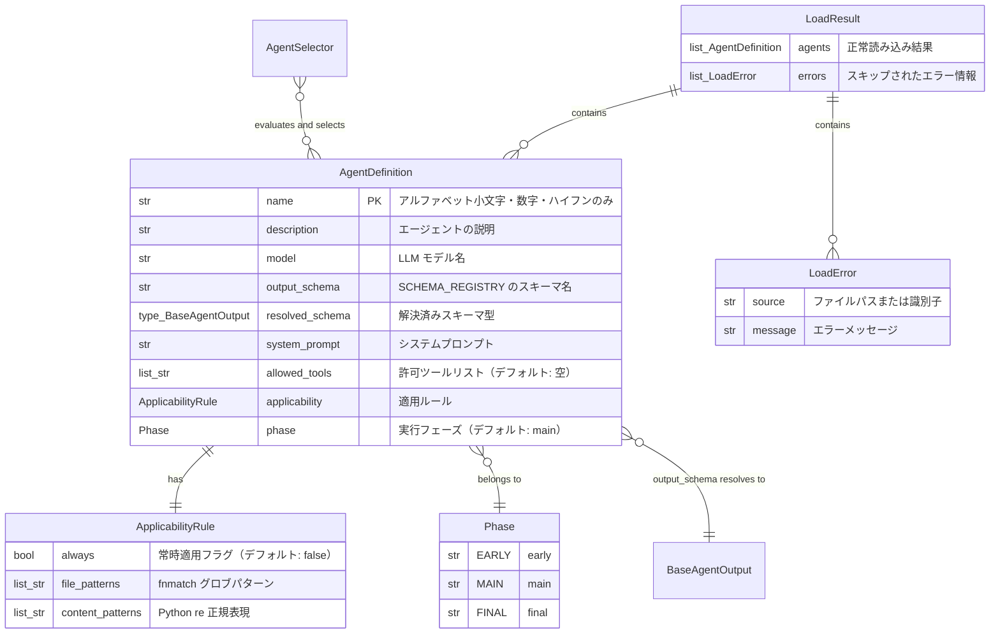

# Data Model: 003-agent-definition

**Date**: 2026-02-06

## Entity Relationship Diagram



## Models

### Phase（実行フェーズ）

**Type**: `StrEnum`
**Module**: `src/hachimoku/agents/models.py`

| Value | Label | Description |
|-------|-------|-------------|
| `"early"` | EARLY | 前処理的な分析 |
| `"main"` | MAIN | メインの詳細レビュー |
| `"final"` | FINAL | 最終的な総合分析 |

**Sort Order**: EARLY (0) → MAIN (1) → FINAL (2)

定数 `PHASE_ORDER: dict[Phase, int]` で順序を定義する。

### ApplicabilityRule（適用ルール）

**Type**: `HachimokuBaseModel`（frozen, extra=forbid）
**Module**: `src/hachimoku/agents/models.py`

| Field | Type | Default | Constraints | Description |
|-------|------|---------|-------------|-------------|
| `always` | `bool` | `False` | - | 常時適用フラグ |
| `file_patterns` | `list[str]` | `[]` | fnmatch 互換グロブ | ファイル名パターン |
| `content_patterns` | `list[str]` | `[]` | Python re 互換正規表現 | コンテンツパターン |

**Validation Rules**:
- `content_patterns` の各要素は有効な正規表現であること（`re.compile()` で検証、失敗時は `ValueError`）

**Condition Evaluation Logic**:
1. `always = True` → 常に適用
2. `file_patterns` のいずれか1つ以上にファイル名がマッチ → 適用
3. `content_patterns` のいずれか1つ以上にコンテンツがマッチ → 適用
4. 上記いずれも該当しない → 不適用

条件 2 と 3 は OR 関係（いずれか一方で適用）。

### AgentDefinition（エージェント定義）

**Type**: `HachimokuBaseModel`（frozen, extra=forbid）
**Module**: `src/hachimoku/agents/models.py`

| Field | Type | Default | Constraints | Description |
|-------|------|---------|-------------|-------------|
| `name` | `str` | - | `^[a-z0-9-]+$`, min_length=1 | エージェント名（一意識別子） |
| `description` | `str` | - | min_length=1 | エージェントの説明 |
| `model` | `str` | - | min_length=1 | LLM モデル名 |
| `output_schema` | `str` | - | SCHEMA_REGISTRY 登録名 | スキーマ名 |
| `resolved_schema` | `type[BaseAgentOutput]` | - | SCHEMA_REGISTRY から解決 | 解決済みスキーマ型 |
| `system_prompt` | `str` | - | min_length=1 | システムプロンプト |
| `allowed_tools` | `list[str]` | `[]` | - | 許可ツールリスト |
| `applicability` | `ApplicabilityRule` | `ApplicabilityRule(always=True)` | - | 適用ルール |
| `phase` | `Phase` | `Phase.MAIN` | Phase 列挙型 | 実行フェーズ |

**Validation Rules**:
- `name`: `^[a-z0-9-]+$` パターンに一致すること
- `output_schema`: SCHEMA_REGISTRY に登録されたスキーマ名であること（`get_schema()` で検証）
- `resolved_schema`: `output_schema` から `get_schema()` で解決した型を保持。TOML には含まれず、モデル構築時に自動設定される（`model_validator` で実装）

**TOML ↔ Model Mapping**:

```toml
name = "code-reviewer"
description = "コード品質・バグ・ベストプラクティスのレビュー"
model = "claude-sonnet-4-5-20250929"
output_schema = "scored_issues"
system_prompt = """
You are a code reviewer...
"""
allowed_tools = []
phase = "main"

[applicability]
always = true
```

### LoadError（読み込みエラー情報）

**Type**: `HachimokuBaseModel`（frozen, extra=forbid）
**Module**: `src/hachimoku/agents/models.py`

| Field | Type | Constraints | Description |
|-------|------|-------------|-------------|
| `source` | `str` | min_length=1 | エラー元のファイルパスまたは識別子 |
| `message` | `str` | min_length=1 | エラーメッセージ（具体的なエラー内容含む） |

### LoadResult（読み込み結果）

**Type**: `HachimokuBaseModel`（frozen, extra=forbid）
**Module**: `src/hachimoku/agents/models.py`

| Field | Type | Default | Description |
|-------|------|---------|-------------|
| `agents` | `list[AgentDefinition]` | - | 正常に読み込まれたエージェント定義リスト |
| `errors` | `list[LoadError]` | `[]` | スキップされたエージェントのエラー情報リスト |

## Functions / Classes

### AgentLoader

**Module**: `src/hachimoku/agents/loader.py`
**Type**: モジュールレベル関数（クラスは不要 — Art.4 Simplicity）

#### `load_builtin_agents() -> LoadResult`

ビルトイン定義ファイルを `hachimoku.agents._builtin` パッケージから読み込む。

**処理フロー**:
1. `importlib.resources.files("hachimoku.agents._builtin")` でリソースディレクトリを取得
2. `.toml` ファイルを列挙
3. 各ファイルを `_load_single_agent()` で読み込み
4. 成功分を `agents`、失敗分を `errors` として `LoadResult` を返す

#### `load_custom_agents(custom_dir: Path) -> LoadResult`

カスタム定義ファイルを指定ディレクトリから読み込む。

**処理フロー**:
1. `custom_dir` が存在しない場合 → 空の `LoadResult` を返す（エラーとしない）
2. `.toml` ファイルを列挙（`.toml` 以外は無視）
3. 各ファイルを `_load_single_agent()` で読み込み
4. 成功分を `agents`、失敗分を `errors` として `LoadResult` を返す

#### `load_agents(custom_dir: Path | None = None) -> LoadResult`

ビルトインとカスタムを統合して読み込む。カスタム定義による上書きを処理する。

**処理フロー**:
1. `load_builtin_agents()` を呼び出し
2. `custom_dir` が指定されている場合 `load_custom_agents(custom_dir)` を呼び出し
3. カスタムエージェントでビルトインを上書き（同名の場合。カスタム側がエラーの場合はビルトインを維持）
4. 全エラーを統合して `LoadResult` を返す

#### `_load_single_agent(path: Path) -> AgentDefinition`

単一の TOML ファイルを読み込み、AgentDefinition を構築する。

**処理フロー**:
1. `tomllib.load()` で TOML をパース（`tomllib.TOMLDecodeError` 時は例外伝播）
2. `AgentDefinition.model_validate(data)` でバリデーション + モデル構築（`pydantic.ValidationError` 時は例外伝播）

### AgentSelector

**Module**: `src/hachimoku/agents/selector.py`
**Type**: モジュールレベル関数

#### `select_agents(agents: list[AgentDefinition], file_paths: list[str], content: str) -> list[AgentDefinition]`

適用ルールに基づいてエージェントを選択し、Phase 順でソートして返す。

**Parameters**:
- `agents`: 選択候補のエージェント定義リスト
- `file_paths`: レビュー対象のファイルパスリスト
- `content`: 差分内容（diff/PR モード）またはファイル内容（file モード）

**Returns**: 適用されるエージェントを Phase 順（early → main → final）、同 Phase 内は名前の辞書順でソートしたリスト

**処理フロー**:
1. 各エージェントの `applicability` を評価
2. 適用されるエージェントを収集
3. `(PHASE_ORDER[agent.phase], agent.name)` のタプルでソート
4. ソート済みリストを返す

#### `_matches(rule: ApplicabilityRule, file_paths: list[str], content: str) -> bool`

単一の ApplicabilityRule を評価する。

**Logic**:
1. `rule.always` が `True` → `True`
2. `rule.file_patterns` のいずれかにファイル名（basename）がマッチ → `True`
3. `rule.content_patterns` のいずれかにコンテンツがマッチ → `True`
4. 上記いずれも該当しない → `False`

## State Transitions

なし（全モデルは frozen。状態遷移はない）

## TOML Schema Reference

```toml
# 必須フィールド
name = "agent-name"                    # ^[a-z0-9-]+$
description = "エージェントの説明"
model = "claude-sonnet-4-5-20250929"
output_schema = "scored_issues"        # SCHEMA_REGISTRY 登録名
system_prompt = """
システムプロンプトの内容
"""

# オプションフィールド
allowed_tools = ["tool1", "tool2"]     # デフォルト: []
phase = "main"                         # "early" | "main" | "final", デフォルト: "main"

# オプション: 適用ルール（省略時は always = true）
[applicability]
always = false                         # デフォルト: false
file_patterns = ["*.py", "*.ts"]       # fnmatch 互換グロブ
content_patterns = ["class\\s+\\w+"]   # Python re 互換正規表現
```
