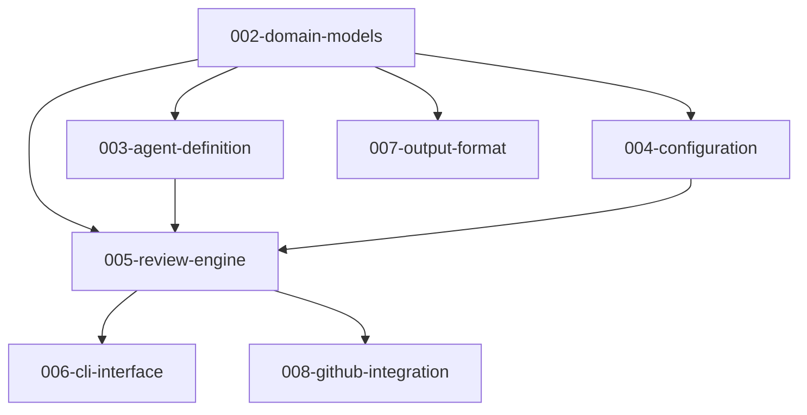

# hachimoku 仕様一覧

## 概要

hachimoku（8moku）のアーキテクチャ仕様と機能仕様を管理するディレクトリ。
`001-architecture-spec` が親仕様として全体像を定義し、`002` 以降の子仕様が機能領域ごとの詳細を定義する。

## 優先度の定義

親仕様のユーザーストーリー（US）優先度に基づく分類:

- **P0**: 全仕様の共通基盤。P1-P3 すべてが依存する前提レイヤー
- **P1**: 基本レビュー実行（US1）に必須
- **P2**: 並列実行（US2）・カスタマイズ（US3）・PR 連携（US6）・初期化（US8）に必須
- **P3**: CI/CD 統合（US4）・設定管理（US5）・管理コマンド（US7）に必須

## 仕様間の依存関係

> **スキーマの所属境界**: SCHEMA_REGISTRY と各エージェントの出力スキーマ（ScoredIssues 等）は **002-domain-models** に含まれる。これらはローダー（003）・ランナー（005）が参照する「ドメインモデル」であり、出力フォーマット（007）はフォーマッター・ストレージのみを担当する。この設計により依存方向が一方向に整理される。

## 仕様一覧

| ID | 名称 | 状態 | 優先度 | 概要 |
|----|------|------|--------|------|
| [001-architecture-spec](./001-architecture-spec/spec.md) | アーキテクチャ仕様（親） | Draft | - | 全体アーキテクチャ、ユーザーストーリー、機能要件、成功基準を定義する親仕様 |
| [002-domain-models](./002-domain-models/spec.md) | ドメインモデル・出力スキーマ | Draft | P0 | Severity, ReviewIssue, AgentResult, ReviewReport 等の共通モデル、6種の出力スキーマ、SCHEMA_REGISTRY、Severity マッピング |
| 003-agent-definition | エージェント定義・ローダー | 未着手 | P1 | TOML 定義フォーマット、AgentDefinition、ApplicabilityRule、ビルトイン6エージェント、ローダー・セレクター |
| 004-configuration | 設定管理 | 未着手 | P2 | HachimokuConfig、4層階層解決、CLAUDE.md 検出・注入 |
| 005-review-engine | レビュー実行エンジン | 未着手 | P1 | 逐次・並列実行、二段階タイムアウト、部分失敗許容、結果集約、シグナルハンドリング |
| 006-cli-interface | CLI インターフェース・初期化 | 未着手 | P1-P3 | Typer app、`8moku`/`hachimoku` デュアルコマンド、`init`・`agents` サブコマンド、終了コード |
| 007-output-format | 出力フォーマット・レビュー蓄積 | 未着手 | P1-P3 | Markdown/JSON フォーマッター、JSONL 蓄積、コスト集計表示 |
| 008-github-integration | GitHub PR・Issue 連携 | 未着手 | P2 | PR メタデータ取得、PR 差分取得、`--issue` コンテキスト注入、GitHub API エラー処理 |

> **006-cli-interface の優先度内訳**: P1 = 基本 CLI・レビュー実行（FR-008, FR-009, FR-017, FR-018, FR-021）、P2 = `init` コマンド（FR-027, FR-028）、P3 = `agents` 管理コマンド（FR-016）

## 子仕様と親仕様の対応

各子仕様が担当する機能要件（FR）・ユーザーストーリー（US）の対応表。

| 子仕様 | 機能要件 | ユーザーストーリー |
|--------|---------|------------------|
| 002-domain-models | FR-004 | - |
| 003-agent-definition | FR-003, FR-005, FR-011, FR-014 | US3 |
| 004-configuration | FR-010, FR-012 | US5 |
| 005-review-engine | FR-001, FR-002, FR-006, FR-007, FR-013 | US1, US2 |
| 006-cli-interface | FR-008, FR-009, FR-016, FR-017, FR-018, FR-021, FR-027, FR-028 | US7, US8 |
| 007-output-format | FR-008, FR-015, FR-025, FR-026 | US4 |
| 008-github-integration | FR-019, FR-020, FR-022, FR-023, FR-024 | US6 |

> **FR-004 の責務境界について**: FR-004（出力スキーマによる型検証）はスキーマ定義（002）とバリデーション実行（005）に跨る。002 はスキーマモデルの定義を担当し、005 は pydantic-ai の `result_type` を通じた実行時バリデーションを担当する。

## 推奨実装順序

依存関係と優先度を考慮した実装順序:

1. **002-domain-models** — 全レイヤーの基盤となる共通モデル・スキーマ定義
2. **003-agent-definition** — エージェントの定義・読み込み・選択（スキーマは 002 で定義済み）
3. **007-output-format** — Markdown フォーマッター基本実装（エンジン開発時の結果確認に必要）
4. **004-configuration** — 設定階層の解決
5. **005-review-engine** — 逐次実行 → 並列実行（設定・エージェント定義に依存）
6. **006-cli-interface** — CLI エントリポイント統合
7. **008-github-integration** — GitHub PR/Issue 連携
